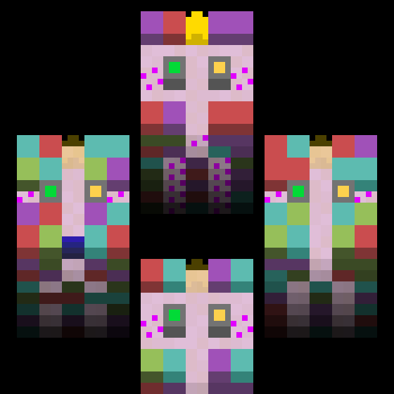
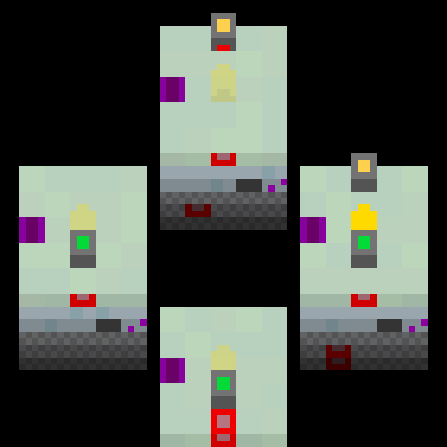

# DIRECTIONDUNGEON!
There's a wall to the left, but you can still go that way, weirdly enough. An abstract puzzle game about strange movement.

This is one of the first games I ever made, so the code is especially sloppy. In fact, it commits the cardinal sin of existing entirely within a single file. Talk about low cohesion.

## Featuring
 - 92 levels, with about 30-60 minutes of puzzle gameplay
 - A clever movement mechanic, taught to the player organically through level design
 - Unlimited undos, letting you quickly fix mistakes
 - A soundtrack composed by yours truly
 
## To run this code, you'll need
 - Python 3.5+
 - PyGame 1.9.4+
Run DIRECTIONDUNGEON/DIRECTIONDUNGEON.py to start the game.

## More GIFs
### Game Start
The start of the game, plus the first few levels.

### Undos
A feature which lets you rewind your moves, in case you want to try something slightly different.

### The Level Stack
You can see upcoming levels stacked underneath your current level. Once you start approaching the end, you can even see the level stack stop!

